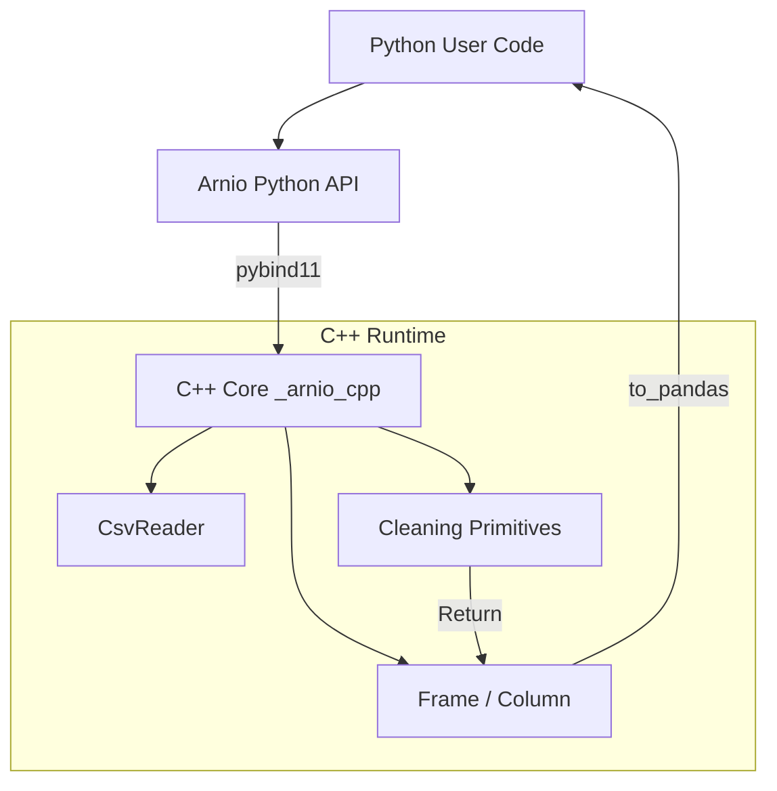
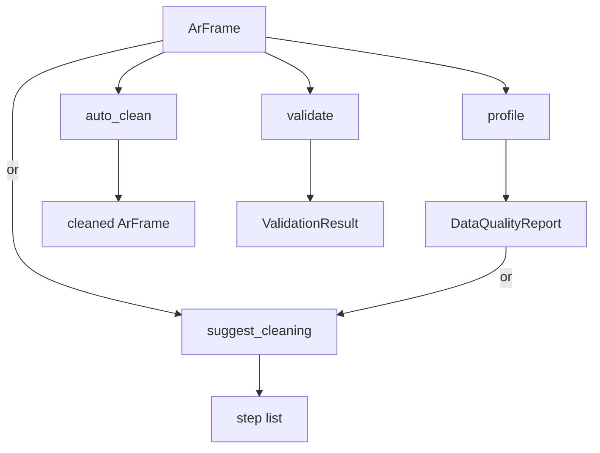

# Arnio Architecture

Arnio is designed to provide high-performance, memory-efficient data ingestion and cleaning by leveraging C++ while maintaining a seamless, declarative Python API.

This document outlines the core architecture and the boundary between Python and C++.

---

## 1. The Core Philosophy

Data preprocessing often involves operations that are inherently slow in Python (e.g., string manipulation, repeated passes over data). Arnio solves this by:

1. **Loading data directly into C++ memory structures.**

2. **Prioritizing native C++ execution for core cleaning operations to avoid Python GIL contention, while seamlessly supporting Python-backed and custom steps.**

3. **Translating the final dataset to a `pandas.DataFrame` via a boundary that aims to minimize unnecessary copies.**

---

## 2. Python ↔ C++ Boundary

The boundary is managed using [`pybind11`](https://github.com/pybind/pybind11).

The C++ core is compiled into a Python extension module (`_arnio_cpp`). The Python API (in `arnio/`) serves as a lightweight, type-hinted wrapper around this compiled extension.



---

## 3. Data Model

Arnio's data model is columnar, strongly resembling Apache Arrow or modern Pandas internals.

### Column

A Column represents a single 1D array of homogeneous data.

- **Variant Storage:** Data is stored using `std::variant` over strongly-typed `std::vector`s (e.g., `std::vector<int64_t>`, `std::vector<std::string>`).

- **Null Handling:** Nulls are tracked via a separate boolean mask (`std::vector<bool>`), allowing the underlying data vectors to remain dense and cache-friendly.

### Frame

A Frame is an ordered collection of Column objects, representing a 2D dataset.

The Frame maintains an index mapping column names to their respective Column objects for O(1) access.

---

## 4. Pandas Dtype Compatibility

Arnio supports a focused set of pandas dtypes directly through its native C++ columnar model.

### Fully Supported

- `int64`

- `float64`

- `bool`

- `string`

These allow efficient parsing and cleaning operations within the C++ core.

### Limited/Unsupported Support

- `category`

- Mixed `object` columns

- Nullable pandas dtypes (e.g., `Int64`)

These may require conversion.

`datetime64[ns]` and `timedelta64[ns]` are currently unsupported in the native runtime.

---

## 5. Pipeline Execution & Dispatch Flow

The `pipeline()` function orchestrates data flow by prioritizing C++ efficiency while allowing Python extensibility.

Arnio supports a mix of C++-backed steps, Python-backed built-ins, and custom pipeline steps.

When a step is invoked, the system follows a priority-based dispatch model:

### Built-in Step Path

The system first queries `_STEP_REGISTRY`.

This built-in registry routes operations to highly optimized native C++ backed steps executing directly within the `Frame` / C++ core.

### Custom Pipeline Steps

If the name is absent from `_STEP_REGISTRY`, the system then checks `_PYTHON_STEP_REGISTRY` for Python-backed built-ins and custom user-defined fallback steps.

### The Conversion Penalty

Because Python-based steps expect a `pandas.DataFrame`, the system performs a roundtrip:

```text
Frame → to_pandas() → from_pandas() → Frame
```

### Performance Note

This roundtrip involves memory re-allocation.

- `to_pandas()` creates a DataFrame representation.

- `from_pandas()` re-infers types to re-populate the internal data structures.

Core cleaning primitives should ideally be implemented as C++ built-ins to bypass this overhead.

---

### Step Backend Execution Map

This map reflects the current pipeline registry defined in `arnio/pipeline.py`.

The current pipeline registry is split into native C++ backed steps and Python/pandas backed steps.

| Step | Backend |
|---|---|
| drop_nulls | Native C++ |
| keep_rows_with_nulls | Native C++ |
| fill_nulls | Native C++ |
| validate_columns_exist | Native C++ |
| drop_duplicates | Native C++ |
| drop_constant_columns | Native C++ |
| clip_numeric | Native C++ |
| strip_whitespace | Native C++ |
| parse_bool_strings | Native C++ |
| normalize_case | Native C++ |
| normalize_unicode | Native C++ |
| rename_columns | Native C++ |
| cast_types | Native C++ |
| round_numeric_columns | Native C++ |
| combine_columns | Native C++ |
| trim_column_names | Native C++ |
| standardize_missing_tokens | Python/pandas |
| filter_rows | Python/pandas |
| drop_columns_matching | Python/pandas |
| safe_divide_columns | Python/pandas |
| replace_values | Python/pandas |
| custom registered steps | Python/pandas |

### Why backend selection matters

Native C++ backed steps execute directly inside the Arnio runtime and avoid pandas conversion overhead.

Python/pandas backed steps use the slower conversion path:

```text
Frame → to_pandas() → from_pandas() → Frame
```

---

## 6. Converting to Pandas

The `to_pandas()` function is a critical boundary.

It uses the NumPy C-API (via pybind11's buffer protocol) to expose the underlying C++ `std::vector` memory to pandas, aiming to avoid element-by-element copies for numerics and booleans where supported.

String columns currently require instantiation of Python `str` objects.

---

## 7. Data Quality and Schema Validation

Arnio is split into two layers:

- The C++ layer handles parsing CSVs, storing data in memory, and cleaning operations such as `drop_nulls()` and `strip_whitespace()`. These execute through pybind11 directly in C++.

- The Python/pandas layer handles data quality: profiling, validation, and schema checks.

Each function in the quality layer behaves as follows:

### `profile()`

- Converts an `ArFrame` to a pandas DataFrame internally.
- Computes per-column statistics including null counts, duplicate rows, data types, and unique value ratios.
- Returns a `DataQualityReport`.

### `suggest_cleaning()`

- Accepts an `ArFrame` or an existing `DataQualityReport`.
- If given an `ArFrame`, it calls `profile()` first.
- Returns a list of cleaning steps that can be passed to `pipeline()`.

### `auto_clean()`

- Accepts an `ArFrame`.
- Calls `profile()` internally.
- Applies suggested cleaning steps directly to the original `ArFrame`.
- Returns a cleaned `ArFrame`.

### `validate()`

- Converts `ArFrame` to a pandas DataFrame internally.
- Evaluates each column against rules defined in a `Schema` including nullability, dtype, range, pattern, and semantic constraints.
- Returns a `ValidationResult`.

### Flow Diagram



---

## 8. Cleaning Module Architecture

The cleaning module is designed around immutable semantics to ensure data integrity across pipeline steps.

To ensure consistency, the C++ core utilizes internal helper functions:

- `resolve_subset`: Translates user-provided column names into integer indices.

- `select_rows`: A utility that takes a list of row indices and constructs a new `Frame`.

- `row_key`: Generates a deterministic string serialization key for a row to facilitate duplicate detection.

### Copy-Always Semantics

Arnio follows an immutable design pattern.

Most cleaning operations do not modify the existing `Frame` in-place; instead, they produce a new `std::vector<Column>` and return a brand-new `Frame` instance, often utilizing `std::move` to transfer ownership efficiently.

---

## 9. Error Handling & Translation

Arnio uses a unified exception hierarchy to bridge the C++/Python boundary.

### Base Exception

- `ArnioError`: The base exception class.

### Specialized Exceptions

- `CsvReadError`

- `UnknownStepError`

- `TypeCastError`

When supported by the specific implementation, exceptions raised within the core are translated into standard Python exceptions to maintain interpreter stability.
